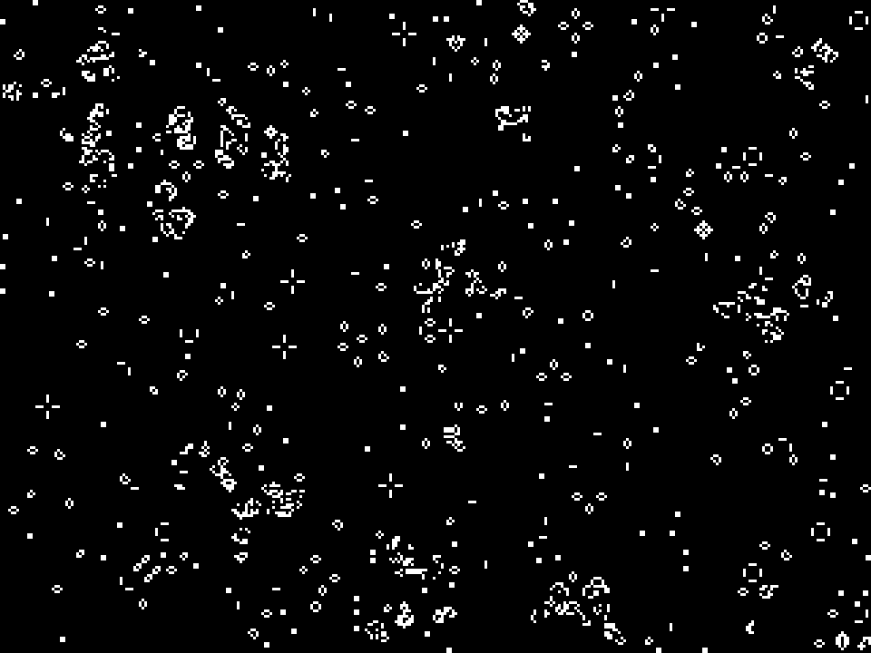

# About

game of life

# Try it

to launch desktop version:

    go get -u github.com/martinlindhe/gol/cmd/gol
    gol

to launch browser version:

    cd $GOPATH/src/github.com/martinlindhe/gol
    gopherjs build -o www/gol.js cmd/gol/main.go
	go run cmd/gol_http/main.go

## License

Under [MIT](LICENSE)
